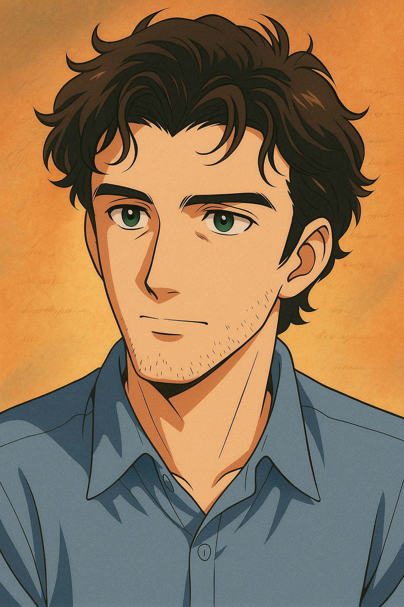

# 👋 Привет! Я Никита — цифровой художник, писатель и человек, которому удалось не сойти с ума после рендера в 4 утра

## 🧠 Кто я такой?

Меня зовут Никита Адамович, и я — тот человек, который может превратить мокрую бумажку в героя видеоигры, а унылую таблицу Excel — в вдохновляющую метафору бренности бытия.  
За последние годы я успел побывать:

- 🎬 Режиссёром независимого кино  
- 📜 Сценаристом, который знает, куда уходит смысл жизни (в третий акт)  
- 🖌️ Цифровым художником с особым отношением к свету, цвету и кофе  
- 🧩 Геймдизайнером, который решил, что душу можно измерять в очках урона  

## 🎮 Что я делаю?

Сейчас я работаю над игрой, где бумажный голубь ищет письма, как будто это философия.  
Также я:

- Создаю 3D-миры в Unreal Engine и Houdini  
- Пишу сценарии, которые пугают продюсеров и радуют фестивали  
- Рисую арты, которые иногда лайкают даже мои родители  
- Изучаю глубины сознания через сны, геймплей и HTML  

## 🤓 Чем я отличаюсь?

- Никогда не забываю про **историю**, даже если это логотип  
- Умею совмещать техническое и поэтичное (и кофе с печеньками)  
- Думаю, что баги — это квесты, просто плохо написанные  
- Считаю, что каждая хорошая идея начинается с фразы «А что, если?..»

## ☕ Связаться со мной

Если вы:

- Хотите сделать игру, фильм или арт-проект, в котором будет душа  
- Или просто хотите обсудить, как настроить камеру в UE5,  
— пишите мне! Не обещаю ответить сразу, но обещаю, что кофе уже готов.

📧 **Email:** your.email@example.com  
🐦 **Telegram:** [@yourhandle](https://t.me/yourhandle)  
🌐 **Портфолио:** [yourwebsite.com](https://yourwebsite.com)